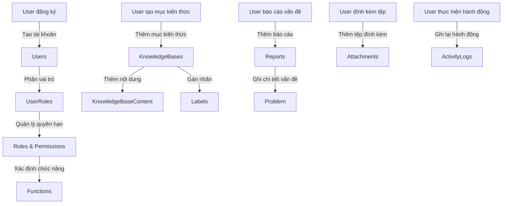

# Introduce

# Database Design
## Categories
| Attribute | Type     | Description              |
|-----------|----------|--------------------------|
| IdPK      | Integer  | Khóa chính. Định danh duy nhất cho mỗi danh mục. |
| Name      | Text     | Tên của danh mục.     |

## KnowledgeBases
| Attribute   | Type     | Description                  |
|-------------|----------|------------------------------|
| IdPK        | Integer  | Khóa chính. Định danh duy nhất cho mỗi mục kiến thức cơ sở.                  |
| Title       | Text     | Tiêu đề của mục kiến thức cơ sở.  |
| Description | Text     | Mô tả về mục kiến thức cơ sở.   |
| Comments    | Text     | Bình luận liên quan đến mục kiến thức cơ sở.|

## KnowledgeBaseContent
| Attribute        | Type     | Description                          |
|------------------|----------|--------------------------------------|
| IdPK             | Integer  | Khóa chính. Định danh duy nhất cho mỗi mục nội dung.                          |
| Content          | Text     | Nội dung thực tế của mục kiến thức cơ sở.  |
| KnowledgeBaseId  | Integer  | Khóa ngoại. Liên kết đến trường IdPK trong bảng KnowledgeBases.  |
| Votes            | Integer  | Số lượng phiếu bầu cho nội dung.                      |

## Reports
| Attribute        | Type     | Description                          |
|------------------|----------|--------------------------------------|
| IdPK             | Integer  | Khóa chính. Định danh duy nhất cho mỗi báo cáo.                          |
| KnowledgeBaseId  | Integer  | Khóa ngoại. Liên kết đến trường IdPK trong bảng KnowledgeBases.  |
| Content          | Text     | Nội dung của báo cáo.                       |

## Users
| Attribute  | Type     | Description             |
|------------|----------|-------------------------|
| IdPK       | Integer  | Khóa chính. Định danh duy nhất cho mỗi người dùng.             |
| FirstName  | Text     | Tên của người dùng.       |
| LastName   | Text     | Họ của người dùng.        |

## Roles
| Attribute | Type     | Description     |
|-----------|----------|-----------------|
| IdPK      | Integer  | Khóa chính. Định danh duy nhất cho mỗi vai trò.     |
| Name      | Text     | Tên của vai trò.|

## UserRoles
| Attribute  | Type     | Description                        |
|------------|----------|------------------------------------|
| RoleIdPK   | Integer  | Khóa ngoại. Liên kết đến trường IdPK trong bảng Roles.         |
| UserIdPK   | Integer  | Khóa ngoại. Liên kết đến trường IdPK trong bảng Users.         |

## Functions
| Attribute | Type     | Description               |
|-----------|----------|---------------------------|
| IdPK      | Integer  | Khóa chính. Định danh duy nhất cho mỗi chức năng.               |
| Name      | Text     | Tên của chức năng.      |
| Url       | Text     | URL liên kết với chức năng.|

## Commands
| Attribute | Type     | Description      |
|-----------|----------|------------------|
| IdPK      | Integer  | Khóa chính. Định danh duy nhất cho mỗi lệnh.      |
| Name      | Text     | Tên của lệnh.|

## Permissions
| Attribute     | Type     | Description                      |
|---------------|----------|----------------------------------|
| FunctionIdPK  | Integer  | Khóa ngoại. Liên kết đến trường IdPK trong bảng Functions.   |

## CommandInFunctions
| Attribute    | Type     | Description                         |
|--------------|----------|-------------------------------------|
| CommandIdPK  | Integer  | Khóa ngoại. Liên kết đến trường IdPK trong bảng Commands.       |
| RoleIdPK     | Integer  | Khóa ngoại. Liên kết đến trường IdPK trong bảng Roles.          |

## Problem
| Attribute       | Type     | Description                |
|-----------------|----------|----------------------------|
| ErrorMessage    | Text     | Mô tả thông điệp lỗi.  |
| Environment     | Text     | Chi tiết môi trường nơi xảy ra vấn đề.        |
| StepToReproduce | Text     | Các bước để tái tạo lại vấn đề.|
| Cause           | Text     | Nguyên nhân của vấn đề.       |
| Resolution      | Text     | Các bước giải quyết vấn đề.           |
| Workaround      | Text     | Các giải pháp thay thế hoặc giải quyết tạm thời.           |
| Note            | Text     | Các ghi chú bổ sung.           |
| SortOrder       | Integer  | Thứ tự sắp xếp để hiển thị.           |
| ParentId        | Integer  | ID vấn đề cha để tổ chức theo dạng cây.            |
| FunctionIdPK    | Integer  | Khóa ngoại. Liên kết đến trường IdPK trong bảng Functions.|

## Labels
| Attribute | Type     | Description         |
|-----------|----------|---------------------|
| IdPK      | Integer  | Khóa chính. Định danh duy nhất cho mỗi nhãn.         |
| Name      | Text     | Tên của nhãn.   |

## LabelInKnowledgeBase
| Attribute        | Type     | Description                         |
|------------------|----------|-------------------------------------|
| KnowledgeBaseIdPK| Integer  | Khóa ngoại. Liên kết đến trường IdPK trong bảng KnowledgeBases. |
| LabelIdPK        | Integer  | Khóa ngoại. Liên kết đến trường IdPK trong bảng Labels.         |

## Status
| Attribute          | Type     | Description                |
|--------------------|----------|----------------------------|
| SeoAlias           | Text     | Bí danh SEO cho trạng thái.                  |
| SeoDescription     | Text     | Mô tả SEO cho trạng thái.            |
| SortOrder          | Integer  | Thứ tự sắp xếp để hiển thị.           |
| ParentId           | Integer  | ID trạng thái cha để tổ chức theo dạng cây.           |
| NumberOfTickets    | Integer  | Số lượng phiếu liên quan đến trạng thái.          |
| NumberOfComments   | Integer  | Số lượng bình luận liên quan đến trạng thái.         |
| NumberOfVotes      | Integer  | Số lượng phiếu bầu cho trạng thái.            |
| NumberOfReports    | Integer  | Số lượng báo cáo liên quan đến trạng thái.          |
| ReportUserId       | Integer  | ID người dùng đã báo cáo trạng thái.    |
| CreateDate         | DateTime | Ngày và giờ tạo trạng thái.              |
| LastModifiedDate   | DateTime | Ngày và giờ sửa đổi trạng thái lần cuối.         |

## ActivityLogs
| Attribute     | Type     | Description                        |
|---------------|----------|------------------------------------|
| IdPK          | Integer  | Khóa chính. Định danh duy nhất cho mỗi mục nhật ký hoạt động.                        |
| Content       | Text     | Nội dung của nhật ký hoạt động.        |
| CreateDate    | DateTime | Ngày và giờ tạo nhật ký.                      |
| UserId        | Integer  | Khóa ngoại. Liên kết đến trường IdPK trong bảng Users.                            |
| Action        | Text     | Mô tả hành động đã thực hiện.                   |
| EntityName    | Text     | Tên của thực thể liên quan đến hành động.                 |
| EntityId      | Integer  | Khóa ngoại. Liên kết đến trường IdPK trong bảng thực thể liên quan.                          |

## Attachments
| Attribute        | Type     | Description                        |
|------------------|----------|------------------------------------|
| IdPK             | Integer  | Khóa chính. Định danh duy nhất cho mỗi tệp đính kèm.                        |
| AttachFilePath   | Text     | Đường dẫn tệp đính kèm.        |
| FileType         | Text     | Loại tệp (ví dụ: PDF, hình ảnh).                   |
| FileSize         | Integer  | Kích thước của tệp (tính bằng byte).                   |
| FileName         | Text     | Tên của tệp.                   |
| KnowledgeBaseId  | Integer  | Khóa ngoại. Liên kết đến trường IdPK trong bảng KnowledgeBases.|
| CommentId        | Integer  | Khóa ngoại. Liên kết đến trường IdPK trong bảng Comments.                         |
| Type             | Text     | Loại tệp đính kèm.                 |
| CreateDate       | DateTime | Ngày và giờ tạo tệp đính kèm.                      |
| LastModifiedDate | DateTime | Ngày và giờ sửa đổi tệp đính kèm lần cuối.                 |

# Luồng xử lý hệ thống

